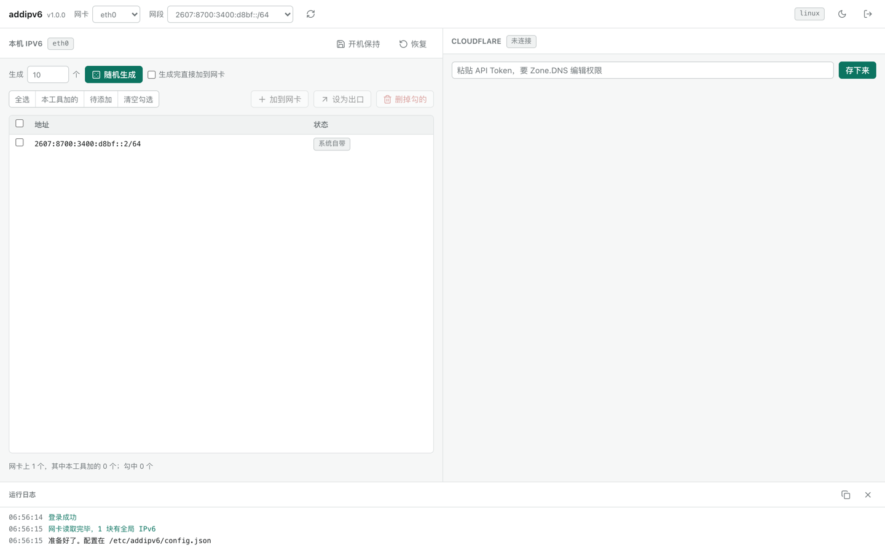
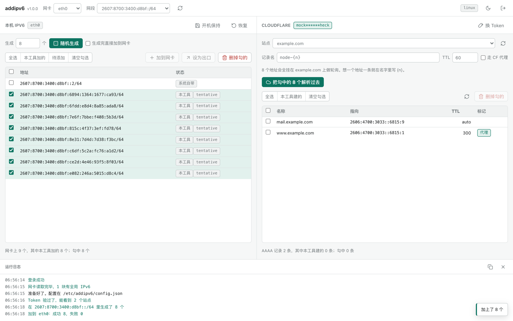
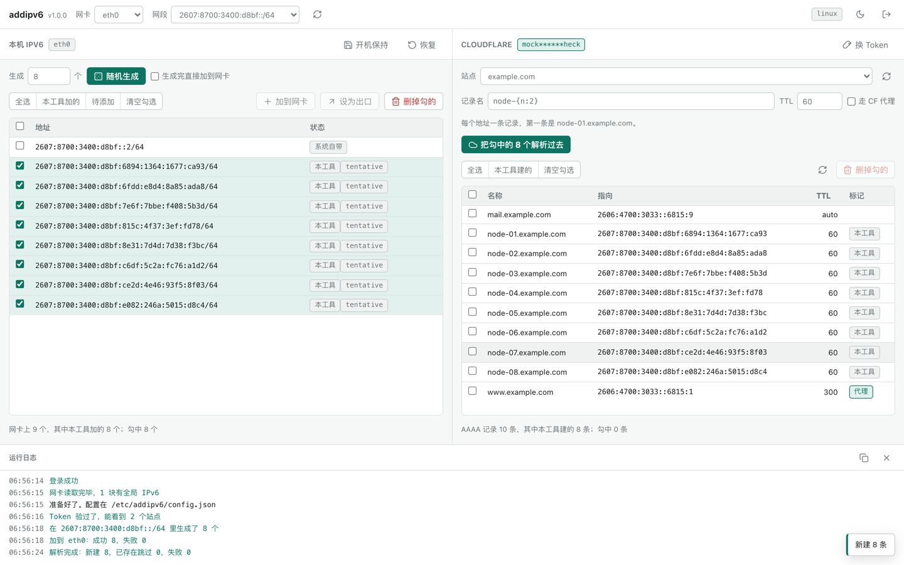
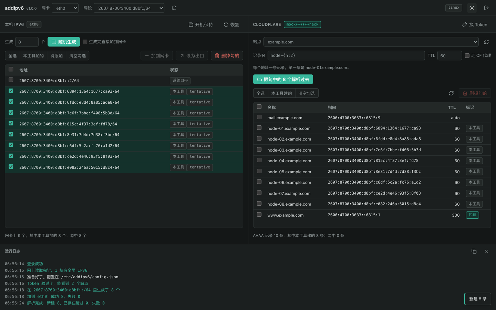

# addipv6

[](https://go.dev)
[](LICENSE)
[](#装哪个文件)
[](https://t.me/+ft-zI76oovgwNmRh)

给 VPS 批量加随机 IPv6，勾一下就能全部解析到 Cloudflare，不要了再一键删干净。带网页界面，一个二进制跑起来就完事。



## 跟老版本有什么不一样

这个项目原来是个 shell 脚本，能用，但有几个地方一直很别扭。这次用 Go 重写顺手都修了：

| 老的 shell 版 | 现在 |
| --- | --- |
| 靠 `python3` 算随机地址，没装就用不了 | 自带随机数，不依赖任何外部命令 |
| 靠 `ip` 命令，还得解析它的文本输出 | 直接走 netlink，不需要装 iproute2 |
| 加过的地址记在 `/tmp`，重启就丢，"一键删除"跟着失效 | 记在 `/var/lib/addipv6`，还能开机自动加回来 |
| 持久化往 `/etc/rc.local` 写，新系统基本不认 | 生成 systemd 服务，没有 systemd 才退回 rc.local |
| 随机范围覆盖整个网段，可能撞上保留地址 | 按 RFC 2526 跳过网段地址和 anycast 保留段 |
| 每执行一个功能就退出，要再来一次得重跑 | 网页界面，开着随便点 |
| 删地址没有拦一下 | 会拦住"把最后一个全局地址删掉"和"删当前出口地址" |
| 没有 Cloudflare 这回事 | 生成的地址能批量写成 AAAA，也能批量删 |

## 装

```bash
bash <(curl -fsSL https://raw.githubusercontent.com/byJoey/addipv6/main/install.sh)
```

会出一个菜单，装、更新、卸载、改密码改端口都在里面：

```
────────────────────────────────────────
  addipv6  批量管理 IPv6 + 解析到 Cloudflare
────────────────────────────────────────
  状态：已安装 v1.1.0  服务 active
────────────────────────────────────────
   1) 安装
   2) 更新到最新版
   3) 卸载
  ────
   4) 启动    5) 停止    6) 重启
   7) 查看状态和访问地址
   8) 看日志
  ────
   9) 改密码
  10) 改端口
   0) 退出
```

不想看菜单就直接带参数，写脚本里也方便：

```bash
bash <(curl -fsSL .../install.sh) install          # 装
bash <(curl -fsSL .../install.sh) update           # 更新，配置和地址记录都不动
bash <(curl -fsSL .../install.sh) status           # 看状态和访问地址
bash <(curl -fsSL .../install.sh) uninstall        # 卸载，配置留着
bash <(curl -fsSL .../install.sh) uninstall purge  # 卸载并清掉配置
```

装完会打印访问地址和密码：

```
✓ 装好了：addipv6 v1.1.0 linux/amd64
  打开  http://1.2.3.4:8688
  密码  Xk3mPq7Rt2Ln
```

密码存在 `/etc/addipv6/password`。忘了就菜单选 7 再看一眼，想换选 9。

有防火墙记得放行 8688。换端口选 10，或者装的时候 `install 9000`。

脚本优先从 Releases 拿预编译的二进制；万一下不动、而机器上有 Go，会自动退回源码编译。

### 装哪个文件

不想用脚本就去 [Releases](https://github.com/byJoey/addipv6/releases) 手动下。不知道该下哪个就先 `uname -m` 看一眼：

| `uname -m` 输出 | 下这个 | 什么机器 |
| --- | --- | --- |
| `x86_64` / `amd64` | `addipv6-linux-amd64` | 绝大多数 VPS 都是这个 |
| `aarch64` / `arm64` | `addipv6-linux-arm64` | Oracle 甲骨文的 ARM、树莓派 4/5 |
| `armv7l` / `armv6l` | `addipv6-linux-arm` | 老树莓派、部分路由器 |
| `i686` / `i386` | `addipv6-linux-386` | 很老的 32 位机器 |
| `riscv64` | `addipv6-linux-riscv64` | RISC-V 开发板 |

下完这么装：

```bash
chmod +x addipv6-linux-amd64
mv addipv6-linux-amd64 /usr/local/bin/addipv6
addipv6 -listen 0.0.0.0:8688
```

## 怎么用

界面左边是本机地址，右边是 Cloudflare，下面是操作日志。一条龙是这样：

**1. 选网卡和网段。** 有全局 IPv6 的网卡才会出现在列表里。多数机器只有一块，自动就选好了。

**2. 填个数量，点随机生成。** 这一步只是算出来给你看，还没动网卡，不想要的可以单独划掉。



**3. 点「加到网卡」。** 这才真正下发。加完的地址会标上「本工具」，跟系统原有的分得清。刚加上会有几秒 `tentative`，那是内核在做重复地址检测，等它自己消失就行。

**4. 勾上要解析的地址，点「把勾中的 N 个解析过去」。** 记录名写法见下一节。



**5. 不要了就勾上「本工具建的」再删。** 本工具建的记录都打了 `addipv6` 注释，一键就能挑出来，不会误伤你手工加的解析。

深色模式和手机上也能用：



## 记录名怎么写

关键就一条：**名字里带不带 `{n}`，行为完全不一样。**

| 记录名填 | 8 个地址会变成 | 什么时候用 |
| --- | --- | --- |
| `node-{n}` | `node-1` 到 `node-8`，各一条 | 想一个地址一个域名 |
| `node-{n:3}` | `node-001` 到 `node-008` | 同上，想要补零对齐 |
| `node-{i}` | `node-0` 到 `node-7`，从 0 开始 | 习惯从 0 数 |
| `v6` | 8 条全叫 `v6`，同名多条 AAAA | 想做 DNS 轮询 |
| 留空或 `@` | 8 条全挂在根域名上 | 根域名轮询 |

不用写完整域名，`node-{n}` 会自动补成 `node-1.你的域名`。写全了也认。

界面上改完名字，下面那行小字会直接告诉你第一条长什么样，不确定就先看一眼。

## 怎么连 Cloudflare

两种都支持，界面上切一下就行。

### API Token（推荐）

去 [API Tokens](https://dash.cloudflare.com/profile/api-tokens) 页面，**Create Token** → 用 **Edit zone DNS** 模板：

- Permissions：`Zone` - `DNS` - `Edit`
- Zone Resources：`Include` - 选你要用的域名（或者 All zones）

建完复制那串贴进去。

### 全局 Key

在 [API Tokens](https://dash.cloudflare.com/profile/api-tokens) 页面最下面 **Global API Key** → View。
要填**两样**：Cloudflare 账号的登录邮箱 + 那串 Key，少一个连不上。邮箱大小写无所谓，会自动转小写。

先说清楚代价：全局 Key 是**整个账户的权限**，能改账单、能删站点、能碰你名下所有域名，而且没法按 zone 限制。
泄露一次等于 CF 账号被接管。能建 Token 就别用它——Token 可以只给一个域名的 DNS 编辑权。

顺带一提，两种认证打的接口都不一样（Token 走 `/user/tokens/verify`，全局 Key 走 `/user`），
填错类型会直接报校验失败，不会默默用错。

### 存在哪

`/etc/addipv6/config.json`，权限 600。界面上只显示头尾各四位（全局 Key 模式额外显示邮箱），
看得出是哪把但泄不出去。

## 开机保持

加上去的地址重启就没了，这是 Linux 的正常行为，不是 bug。点一下界面上的「开机保持」，它会装一个 systemd 服务：

```bash
systemctl status addipv6-restore    # 看状态
journalctl -u addipv6-restore       # 看它开机时干了啥
```

开机时会按记录把地址重新加回来，连你设的出口地址一起恢复。验证过真重启，日志长这样：

```
Starting addipv6-restore.service - addipv6 开机恢复 IPv6 地址...
level=INFO msg=恢复完成 成功=4 失败=0
Finished addipv6-restore.service - addipv6 开机恢复 IPv6 地址.
```

也可以手动跑：`addipv6 restore`。这命令是幂等的，地址已经在了就跳过，随便跑几次都行。

## 命令行参数

```
addipv6 [参数]           起 Web 界面
addipv6 restore          把记录过的地址重新加回网卡
addipv6 version          看版本
```

| 参数 | 默认 | 说明 |
| --- | --- | --- |
| `-listen` | `0.0.0.0:8688` | 监听地址。只想本机访问就写 `127.0.0.1:8688`，然后用 SSH 隧道进来 |
| `-password` | 自动生成 | 登录密码。也可以用环境变量 `ADDIPV6_PASSWORD` |
| `-config-dir` | `/etc/addipv6` | 配置放哪 |
| `-state-dir` | `/var/lib/addipv6` | 地址记录放哪 |
| `-tls-cert` / `-tls-key` | 空 | 两个都给就走 HTTPS |
| `-restore-on-start` | 关 | 启动时先恢复一遍地址 |

## 几个要知道的事

**要 root 或者 CAP_NET_ADMIN。** 改网卡地址就是要这个权限，装出来的 systemd 服务只给了这一个能力，别的一概不给。

**公网开着记得想清楚。** 默认监听 `0.0.0.0`，图的是开箱能用。密码是随机 12 位，登录失败 5 次开始指数级锁，但要更稳妥的话建议改成 `127.0.0.1` 然后走 SSH 隧道：

```bash
ssh -L 8688:127.0.0.1:8688 root@你的服务器
```

**删地址有两道保险。** 一次删完网卡上所有全局地址会被拦下来，删当前出口地址也会被拦。真要删就勾「强制执行」——勾之前先确认你还有别的路进得去。

**批量上限 1000 个**，Cloudflare 那边按 4 次/秒发，撞到限流会自己退避重试。解析是幂等的，同名同地址的记录已经有了就跳过，重复点不会建出一堆重复解析。

**加完地址，出站源地址可能会变。** 这是内核按 RFC 6724 自己挑的，一行路由都没动它也会换。
机器上有服务绑着旧地址的话会很难查，所以加完发现出口变了工具会在日志里提醒你。
想钉死用哪个，勾中它点「设为出口」。

**IPv6 通不通是另一回事。** 这工具只管把地址加到网卡上、把解析写进 Cloudflare。
上游有没有真的把这个 /64 路由给你，得问你的服务商。加完 `ping6` 不通先这么查：

```bash
ip -6 neigh                 # 网关是 FAILED / INCOMPLETE 就是二层都没通
rdisc6 -1 -w 3000 eth0      # 收不到路由宣告，基本可以确定上游没配
```

判断是不是工具的问题有个简单办法：**拿服务商原本分配给你的那个地址做同样的测试**。
它要是也不通，那就跟工具没关系。

## IPv6 是 6in4 隧道的情况

有些服务商（KiwiVM 面板那一挂，搬瓦工之类）给的 IPv6 **不是原生的，是 6in4 SIT 隧道**。
这种机器直接往 `eth0` 上配 IPv6 怎么弄都不通——因为流量压根不走 `eth0`。

面板上会给你隧道两端的地址，照着建一个隧道接口：

```bash
ip tunnel add ipv6net mode sit local <你的IPv4> remote <面板给的对端> ttl 255
ip link set ipv6net up mtu 1480
ip addr add <你的IPv6>/64 dev ipv6net
ip route add ::/0 dev ipv6net
```

Debian/Ubuntu 写进 `/etc/network/interfaces` 持久化：

```
auto ipv6net
iface ipv6net inet6 v4tunnel
    address <你的IPv6>
    netmask 64
    endpoint <面板给的对端>
    local <你的IPv4>
    ttl 255
    gateway <面板给的网关>
```

弄好之后 `ipv6net` 会作为一块网卡出现在界面的下拉框里，跟普通网卡一样用。
这种隧道是点对点链路，默认路由长这样 `default dev ipv6net`，**没有网关**，工具认得这种形态。

面板上有「关机再开机」选项的话也可以让它自动配（注意是完全关机再开，`reboot` 不算）。

## 自己编译

```bash
git clone https://github.com/byJoey/addipv6.git
cd addipv6
go build .          # 就编当前平台
./build.sh          # 编全部五个平台，产物在 dist/
go test ./...       # 跑测试
```

## 协议

MIT，见 [LICENSE](LICENSE)。

## 关于

作者 Joey，原项目是一个 shell 脚本，这版是 Go 重写并加上了网页界面和 Cloudflare 批量解析。

- 博客 [joeyblog.net](https://joeyblog.net)
- TG 群 [t.me/+ft-zI76oovgwNmRh](https://t.me/+ft-zI76oovgwNmRh)
- YouTube [@joeyblog](https://youtube.com/@joeyblog)
- GitHub [@byJoey](https://github.com/byJoey)

**免责**：这工具会改你机器的网络配置。操作前请确保你有别的方式能连上服务器（比如 VNC 或者救援模式）。因使用本工具造成的任何损失，作者不承担责任。合理使用。
